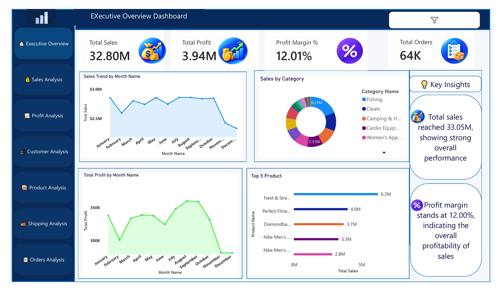
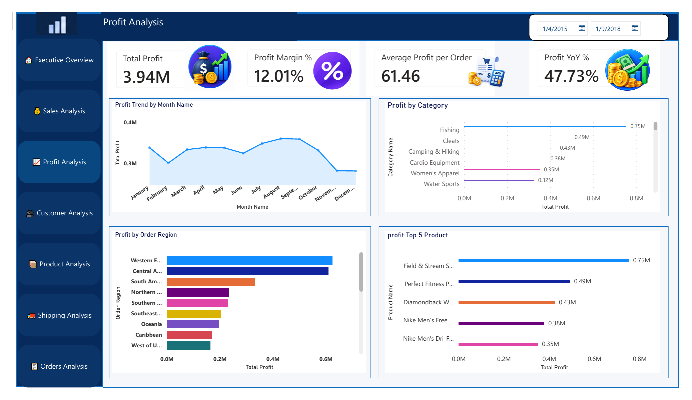
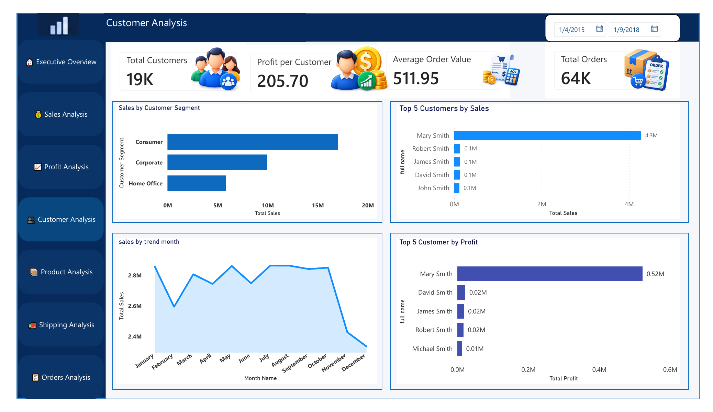
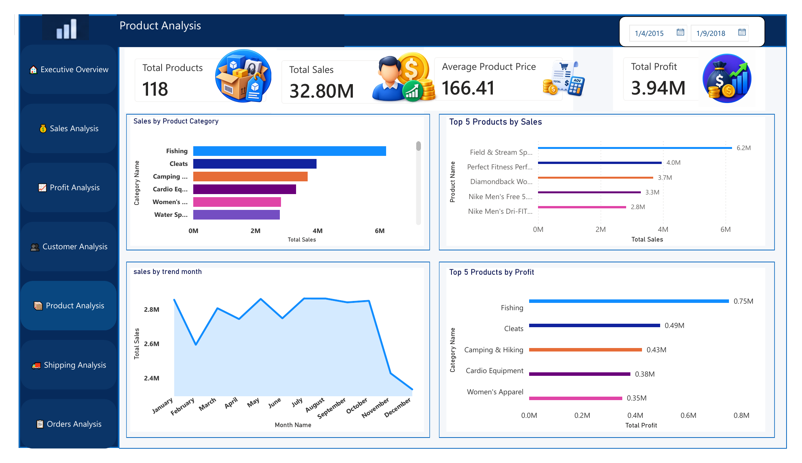
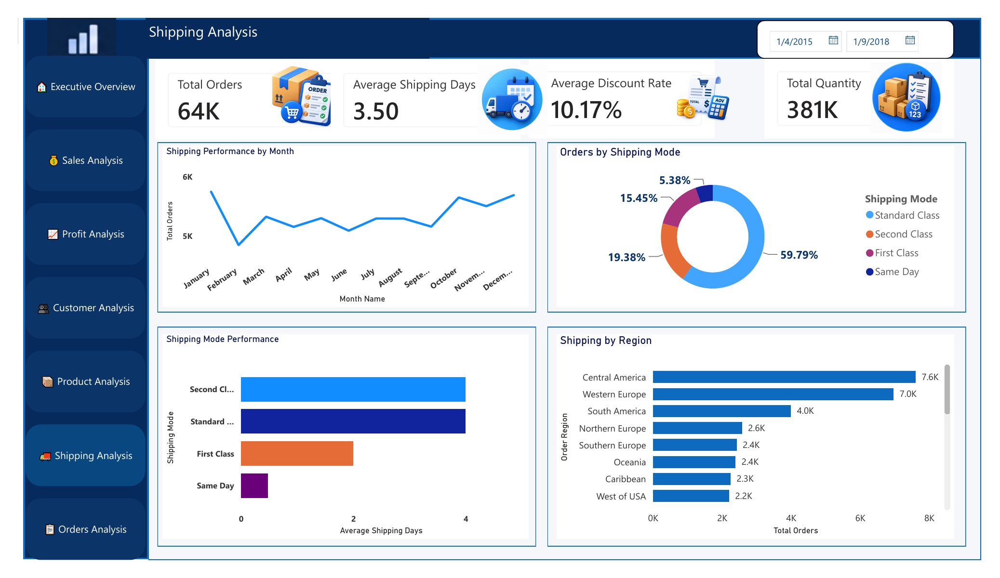
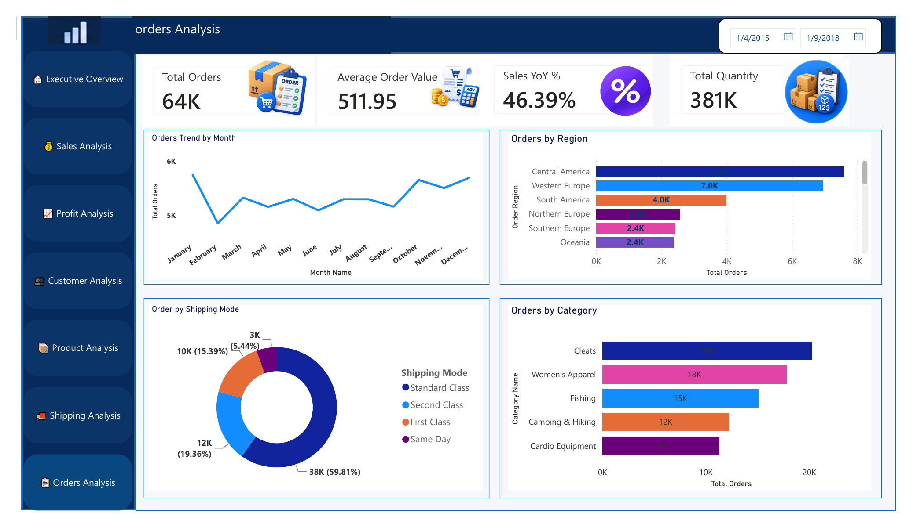

# 📊 Supply Chain Performance Dashboard

An interactive Power BI dashboard designed to analyze supply chain performance across sales, profit, customers, products, shipping, and orders.

## 🎯 Project Objective

The goal of this project is to transform supply chain data into an interactive business intelligence dashboard that provides a clear view of performance and supports data-driven decision-making.

## 🛠️ Tools & Technologies

- Power BI
- DAX
- Power Query
- Excel
- Data Analysis
- Data Visualization

## 📌 Dashboard Pages

### 🏠 Executive Overview

Provides a high-level view of overall performance, including Total Sales, Total Profit, Profit Margin, Total Orders, sales and profit trends, category performance, and top products.

### 💰 Sales Analysis

Analyzes sales performance through monthly trends, sales by category, sales by region, and the top 5 products by sales.

### 📈 Profit Analysis

Focuses on profitability using Total Profit, Profit Margin, Average Profit per Order, Profit YoY, monthly profit trends, category profitability, regional profitability, and top products by profit.

### 👥 Customer Analysis

Analyzes customer performance using customer segments, top customers by sales, monthly sales trends, and top customers by profit.

### 📦 Product Analysis

Provides product-level analysis including total products, average product price, sales by category, top products by sales, monthly sales trends, and top categories by profit.

### 🚚 Shipping Analysis

Evaluates shipping performance using total orders, average shipping days, average discount rate, total quantity, shipping trends, shipping modes, and regional shipping performance.

### 📋 Orders Analysis

Analyzes order behavior through order trends, regional distribution, shipping modes, and orders by product category.

## 📊 Key Metrics

- Total Sales: 32.80M
- Total Profit: 3.94M
- Profit Margin: 12.01%
- Total Orders: 64K
- Total Customers: 19K
- Total Products: 118
- Total Quantity: 381K
- Average Order Value: 511.95
- Average Shipping Days: 3.50
- Average Discount Rate: 10.17%

## 💡 Business Value

This dashboard provides a centralized view of supply chain performance and helps decision-makers quickly identify:

- Sales performance trends
- Profitability opportunities
- High-performing products
- Important customers
- Shipping performance patterns
- Order performance patterns
- Regional performance differences

The goal is to turn operational data into clear and actionable business insights.

## 📥 Download Power BI Dashboard

The complete interactive Power BI `.pbix` file is available on Google Drive because of GitHub file-size limitations.

👉 [**Download the Complete Power BI Dashboard (.pbix)**](https://drive.google.com/file/d/1oOgT6wGeDihhWCBaH0vEOYnjrbupSFnF/view?usp=sharing)

## 👨‍💻 Author

**Mohamed Elshehawy**

Data Analyst | Power BI | Excel | SQL

📌 GitHub: [mohamedelshehawy-DATA](https://github.com/mohamedelshehawy-DATA)

---

⭐ If you find this project useful, feel free to explore the repository and check out the dashboard screenshots.
